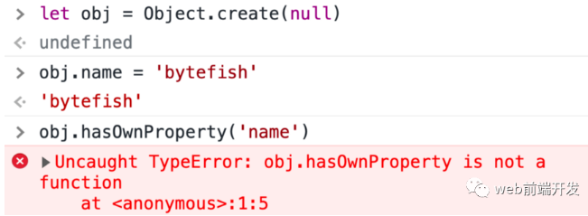

# 对象属性检测

## in

*   `in` 运算符仅仅会简单地判断属性是否存在，而不会去读属性的值

    ```javascript
    // 自定义对象
    var mycar = {make: "Honda", model: "Accord", year: 1998};
    "make" in mycar  // 返回true
    "model" in mycar // 返回true

    var isBool = ("abc" in mycar) // 返回true
    console.log(isBool);
    ```

    ```javascript
    // 内置对象
    "PI" in Math          // 返回true
    ```

    ```javascript
    // 数组
    var trees = new Array("redwood", "bay", "cedar", "oak", "maple");
    0 in trees        // 返回true
    3 in trees        // 返回true
    6 in trees        // 返回false
    "bay" in trees    // 返回false (必须使用索引号,而不是数组元素的值)
    "length" in trees // 返回true (length是一个数组属性)

    Symbol.iterator in trees // 返回true (数组可迭代，只在ES2015+上有效)
    ```

*   如果一个属性是从原型链上继承来的，`in` 运算符也会返回 `true`。

    ```javascript
    "toString" in {}; // 返回true
    ```

## hasOwnProperty() 方法

*   `Object.prototype.hasOwnProperty` 方法接受一个字符串作为参数，返回一个布尔值，表示该实例对象自身是否具有该属性。

    ```javascript
    // 对象obj自身具有p属性，所以返回true。
    // toString属性是继承的，所以返回false。
    var obj = {
      p: 123
    };

    obj.hasOwnProperty('p') // true
    obj.hasOwnProperty('toString') // false
    ```

    ```javascript
    o = new Object();
    o.hasOwnProperty('prop'); // 返回 false
    o.prop = 'exists';
    o.hasOwnProperty('prop'); // 返回 true
    delete o.prop;
    o.hasOwnProperty('prop'); // 返回 false
    ```

*   即使属性的值是 `null` 或  `undefined`，只要属性存在，`hasOwnProperty` 依旧会返回 `true`

    ```javascript
    const o = new Object();
    o.propOne = null;
    o.hasOwnProperty('propOne'); // 返回 true
    o.propTwo = undefined;  
    o.hasOwnProperty('propTwo'); // 返回 true
    ```

*   缺点

    *   如果对象是用 `Object.create(null)` 创建的话，那么就不能用这个方法了

        

## Object.prototype.hasOwnProperty()

*   解决前面的问题很简单，我们只需要使用`Object.prototype.hasOwnProperty`

*   该方法是直接调用内置的有效用函数，跳过原型链

    

## Object.hasOwn()

*   如果指定的对象具有指定的属性作为其自己的属性，则 `Object.hasOwn()` 静态方法返回 `true`。如果属性被继承或不存在，则该方法返回 `false`

*   新的静态方法 —ES2022&#x20;

    ```javascript
    let object = { foo: false }
    Object.hasOwn(object, "foo") // true

    let object2 = Object.create({ foo: true })
    Object.hasOwn(object2, "foo") // false

    let object3 = Object.create(null)
    Object.hasOwn(object3, "foo") // false
    ```
