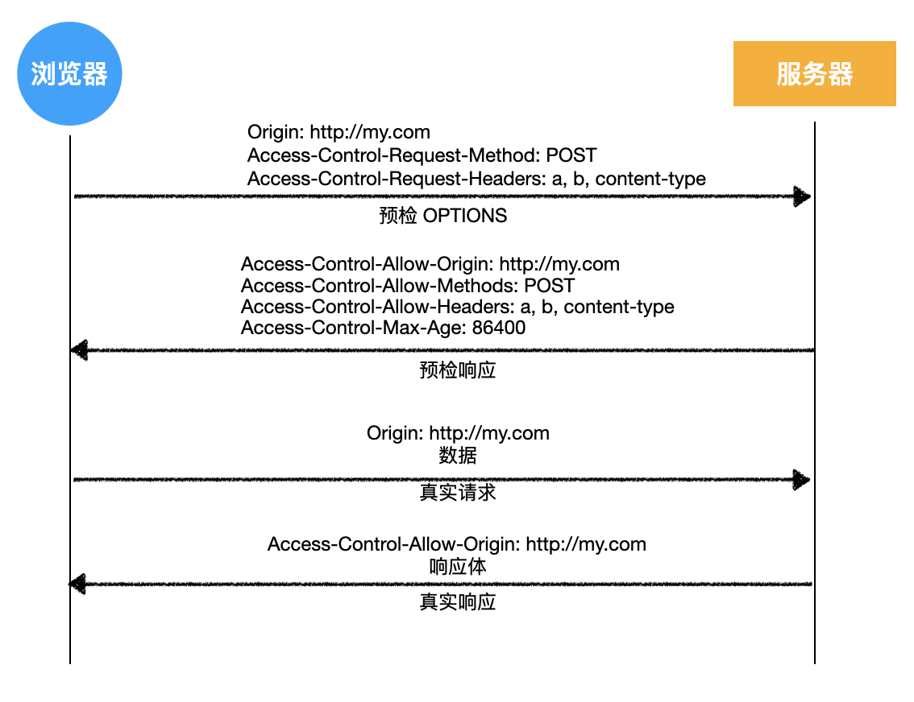

# 预检请求

## 概述

  - 简单的请求对服务器的威胁不大，所以允许使用上述的简单交互即可完成。

  - 但是，如果浏览器不认为这是一种简单请求，就会按照下面的流程进行：

    1.  **浏览器发送预检请求，询问服务器是否允许**

    2.  **服务器允许**

    3.  **浏览器发送真实请求**

    4.  **服务器完成真实的响应**

  - 比如，在页面`http://my.com/index.html`中有以下代码造成了跨域

    ```javascript
    // 需要预检的请求
    fetch("http://crossdomain.com/api/user", {
      method:"POST", // post 请求
      headers:{  // 设置请求头
        a: 1,
        b: 2,
        "content-type": "application/json"
      },
      body: JSON.stringify({ name: "袁小进", age: 18 }) // 设置请求体
    });
    ```

## 1. 浏览器发送预检请求，询问服务器是否允许

  - 预检请求

    ```javascript
    OPTIONS /api/user HTTP/1.1               // 预检请求的方法为OPTIONS
    Host: crossdomain.com
    ...
    Origin: http://my.com                    // 预请求的源
    Access-Control-Request-Method: POST      // 后续的真实请求将使用的请求方法
    Access-Control-Request-Headers: a, b, content-type  // 后续的真实请求会改动的请求头
                                                        // 没有请求体

    ```

  - 可以看出，这并非我们想要发出的真实请求，请求中不包含我们的响应头，也没有消息体。

  - 这是一个预检请求，它的目的是询问服务器，是否允许后续的真实请求。

  - 预检请求**没有请求体**，它包含了后续真实请求要做的事情

  - 预检请求有以下特征：

      - 请求方法为`OPTIONS`

      - 没有请求体

      - 请求头中包含

          - `Origin`：请求的源，和简单请求的含义一致

          - `Access-Control-Request-Method`：后续的真实请求将使用的请求方法

          - `Access-Control-Request-Headers`：后续的真实请求会改动的请求头

## 2. 服务器允许

  - 服务器收到预检请求后，可以检查预检请求中包含的信息，如果允许这样的请求，需要响应下面的消息格式

    ```javascript
    HTTP/1.1 200 OK
    Date: Tue, 21 Apr 2020 08:03:35 GMT
    ...
    Access-Control-Allow-Origin: http://my.com        // 和简单请求一样，表示允许的源
    Access-Control-Allow-Methods: POST                // 表示允许的后续真实的请求方法
    Access-Control-Allow-Headers: a, b, content-type  // 表示允许改动的请求头
    Access-Control-Max-Age: 86400                     // 告诉浏览器，多少秒内，对于同样的请求源、方法、头，都不需要再发送预检请求了
    ...
    ```

  - 对于预检请求，不需要响应任何的消息体，只需要在响应头中添加：

      - `Access-Control-Allow-Origin`：和简单请求一样，表示允许的源

      - `Access-Control-Allow-Methods`：表示允许的后续真实的请求方法

      - `Access-Control-Allow-Headers`：表示允许改动的请求头

      - `Access-Control-Max-Age`：告诉浏览器，多少秒内，对于同样的请求源、方法、头，都不需要再发送预检请求了

## 3. 浏览器发送真实请求

  - 预检被服务器允许后，浏览器就会发送真实请求了，上面的代码会发生下面的请求数据

    ```javascript
    POST /api/user HTTP/1.1
    Host: crossdomain.com
    Connection: keep-alive
    ...
    Referer: http://my.com/index.html
    Origin: http://my.com

    {"name": "袁小进", "age": 18 }
    ```

## 4. 服务器响应真实请求

  - 响应

    ```javascript
    HTTP/1.1 200 OK
    Date: Tue, 21 Apr 2020 08:03:35 GMT
    ...
    Access-Control-Allow-Origin: http://my.com
    ...

    添加用户成功
    ```

  - 可以看出，当完成预检之后，后续的处理与简单请求相同

  - 下图简述了整个交互过程

    
