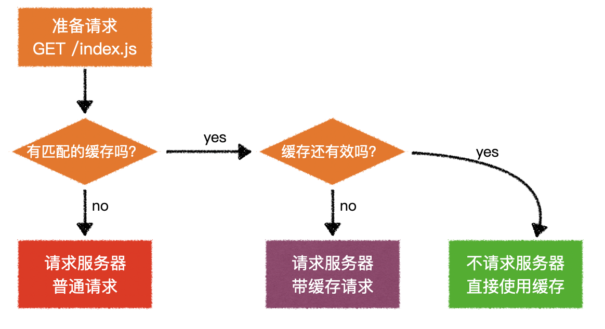
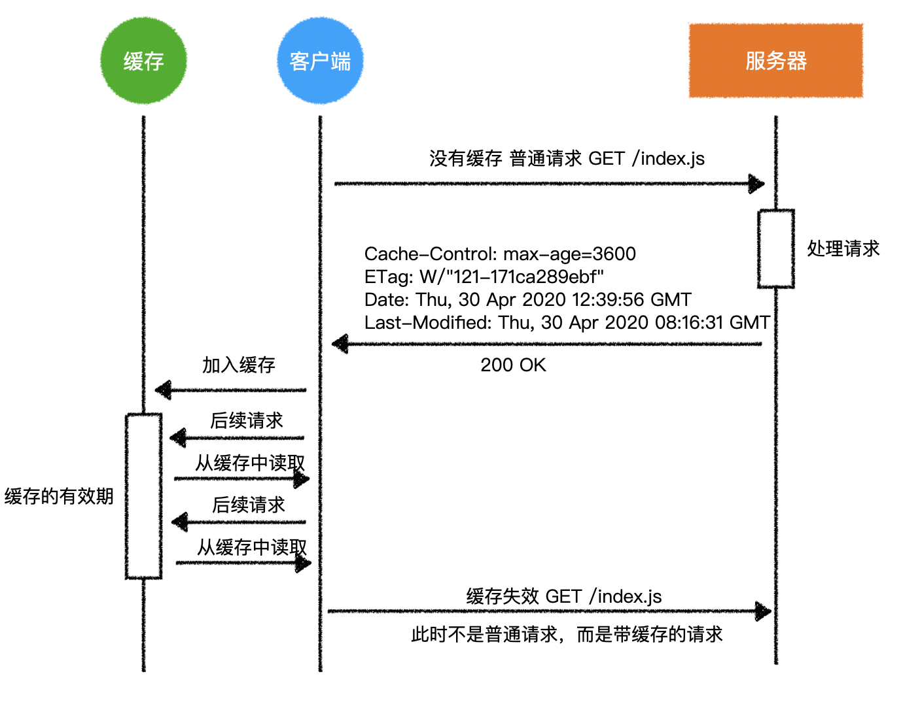
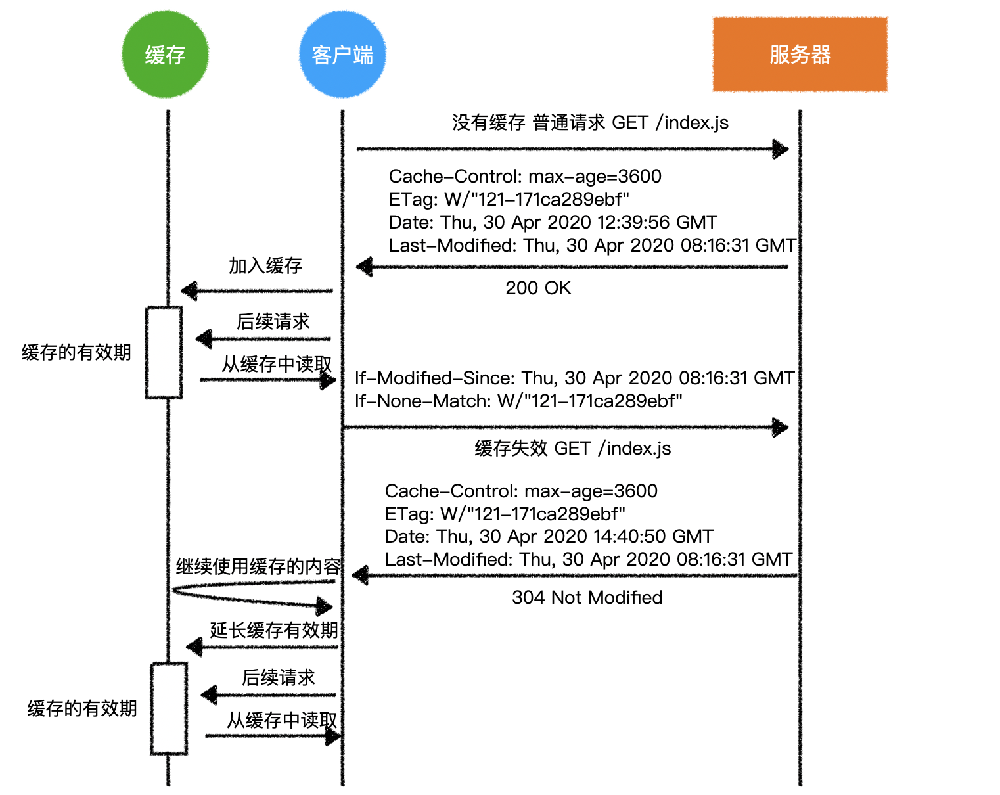

# 客户端缓存

## 概述

  - 所谓**客户端缓存**，顾名思义，是将某一次的响应结果保存在客户端（比如浏览器）中，而后续的请求仅需要从缓存中读取即可，极大的降低了服务器的处理压力

  - 客户端缓存的原理如下（简易的原理图，实际情况可能有差异）

    

## 缓存策略的问题

  - 哪些资源需要加入到缓存，哪些不需要？

  - 缓存的时间是多久呢？

  - 如果服务器的资源有改动，客户端如何更新缓存呢？

  - 如果缓存过期了，可是服务器上的资源并没有发生变动，又该如何处理呢？

  - .......

来自服务器的缓存指令

  - 当客户端发出一个`get`请求到服务器，服务器可能有以下的内心活动：「你请求的这个资源，我很少会改动它，干脆你把它缓存起来吧，以后就不要来烦我了」

  - 为了表达这个美好的愿望，服务器在**响应头**中加入了以下内容

    ```text
    Cache-Control: max-age=3600                   // 我希望你把这个资源缓存起来，缓存时间是3600秒（1小时）
    ETag: W/"121-171ca289ebf"                     // 这个资源的编号是W/"121-171ca289ebf"
    Date: Thu, 30 Apr 2020 12:39:56 GMT           // 我给你响应这个资源的服务器时间是格林威治时间2020-04-30 12:39:56
    Last-Modified: Thu, 30 Apr 2020 08:16:31 GMT  // 这个资源的上一次修改时间是格林威治时间2020-04-30 08:16:31
    ```

  - 这个美好的缓存愿望，就这样通过响应头传递给客户端了

  - 如果客户端是其他应用程序，可能并不会理会服务器的愿望，也就是说，可能根本不会缓存任何东西

  - 但是凑巧客户端是一个浏览器，它和服务器一直以来都是相亲相爱的小伙伴，当它看到服务器的这个响应头表达的美好愿望后，立即忙起来

      - 浏览器把这次请求得到的响应体缓存到本地文件中

      - 浏览器标记这次请求的请求方法和请求路径

      - 浏览器标记这次缓存的时间是3600秒

      - 浏览器记录服务器的响应时间是格林威治时间`2020-04-30 12:39:56`

      - 浏览器记录服务器给予的资源编号`W/"121-171ca289ebf"`

      - 浏览器记录资源的上一次修改时间是格林威治时间`2020-04-30 08:16:31`

  - 这一次的记录非常重要，它为以后浏览器要不要去请求服务器提供了各种依据

    

## 来自客户端的缓存指令

  - 当客户端收拾好行李，准备再次请求`GET /index.js`时，它突然想起了一件事：我需要的东西在不在缓存里呢？

  - 此时，客户端会到缓存中去寻找是否有缓存的资源

  - 寻找的过程如下：

    1.  缓存中是否有匹配的请求方法和路径？

          - 要验证是否有匹配的缓存非常简单，只需要验证当前的请求方法`GET`和当前的请求路径`/index.js`是否有对应的缓存存在即可

          - 如果没有，就直接请求服务器，就和第一次请求服务器时一样

    2.  如果有，该缓存资源是否还有效呢？

          - 非常简单，就是把`max-age + Date`，得到一个过期时间，看看这个过期时间是否大于当前时间，如果是，则表示缓存还没有过期，仍然有效，如果不是，则表示缓存失效

  - 以上两个验证会导致浏览器产生不同的行为

    

    

## 缓存有效

  - 当浏览器发现缓存有效时，完全不会请求服务器，直接使用缓存即可得到结果

  - 此时，如果你断开网络，会发现资源仍然可用

  - 这种情况会极大的降低服务器压力，但当服务器更改了资源后，浏览器是不知道的，只要缓存有效，它就会直接使用缓存

## 缓存无效

  - 当浏览器发现缓存已经过期，它**并不会简单的把缓存删除**，而是抱着一丝希望，想问问服务器，我**这个缓存还能继续使用吗**？

  - 于是，浏览器向服务器发出了一个**带缓存的请求**

  - 所谓带缓存的请求，无非就是加入了以下的请求头：

    ```纯文本
    If-Modified-Since: Thu, 30 Apr 2020 08:16:31 GMT // 亲，你曾经告诉我，这个资源的上一次修改时间是格林威治时间2020-04-30 08:16:31，请问这个资源在这个时间之后有发生变动吗？
    If-None-Match: W/"121-171ca289ebf"              // 亲，你曾经告诉我，这个资源的编号是W/"121-171ca289ebf，请问这个资源的编号发生变动了吗？
    ```

  - 其实，这两个问题可以合并为一个问题：快说！资源到底变了没有！

  - 之所以要发两个信息，是为了兼容不同的服务器，因为有些服务器只认`If-Modified-Since`，有些服务器只认`If-None-Match`，有些服务器两个都认

      - 目前的很多服务器，只要发现`If-None-Match`存在，就不会去看 `If-Modified-Since`

      - `If-Modified-Since`是`http1.0`版本的规范，`If-None-Match`是`http1.1`的规范

  - 此时，问题又抛给了服务器，接下来，就是服务器的表演时间了。服务器可能会产生两个情况：

      - 缓存已经失效

          - 那么非常简单，服务器再次给予一个正常的响应（响应码`200` 带响应体），同时可以附带上新的缓存指令，这就回到了上一节——来自服务器的缓存指令

          - 这样一来，客户端就会重新缓存新的内容

      - 缓存仍然有效：如果服务器觉得**缓存仍然有效**，它可以通过一种极其简单的方式告诉客户端

          - 响应码为`304 Not Modified`

          - 无响应体

          - 响应头带上新的缓存指令，见上一节——来自服务器的缓存指令

          - 这样一来，就相当于告诉客户端：「你的缓存资源仍然可用，我给你一个新的缓存时间，你那边更新一下就可以了」

          - 于是，客户端就继续happy的使用缓存了

          - 这样一来，可以最大程度的减少网络传输，因为如果资源还有效，服务器就不会传输消息体

  - 它们完整的交互过程如下

    

*
