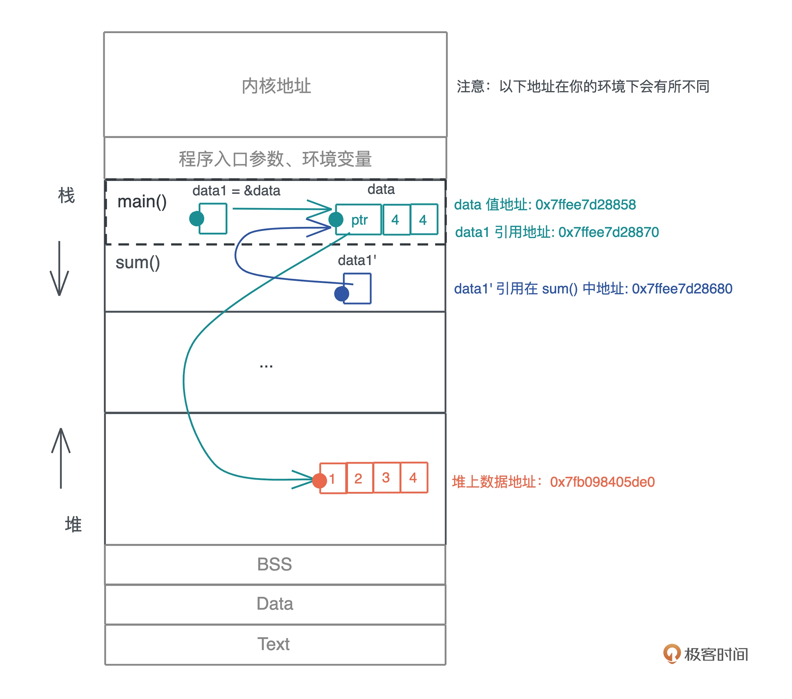

# 只读借用/引用

## Borrow 语义

*   Borrow 语义允许一个值的所有权，在不发生转移的情况下，被其它上下文使用（**临时使用权**）

*   如果我们想避免 Copy 或者 Move，可以使用 借用/引用

*   实现方式：通过引用语法( `&` 或 `&mut` )来实现

## Rust的借用与引用

*   在 Rust 中，“借用”和“引用”是一个概念。只不过在其他语言中引用的意义和 Rust 不同，所以 Rust 提出了新概念“借用”，便于区分

*   **默认情况下，Rust 的借用都是只读**

## 函数参数传值

*   在其他语言中函数传参有两种方式

    *   传值：参数是整数。与 Rust 的 Copy 语义一致

    *   传引用：传一个对象或任何堆上的数据结构，会自动隐式的传递引用

*   在 Rust 中没有传引用的概念，**Rust 所有的参数传递都是传值**，不管是 Copy 还是 Move。所以在 Rust 中必须显式地把某个数据的引用传递给另外一个函数

## 只读借用/引用

*   Rust 的引用实现了 Copy trait，所以按照 Copy 语义，这个引用会被复制一份交给要调用的函数。

*   对这个函数来说，它并不拥有数据本身，数据只是临时借给它使用，所有权还在原来的拥有者那里

*   在 Rust 里，引用是一等公民，和其他数据类型地位相等

    ```rust

    fn main() {
        let data = vec![1, 2, 3, 4];
        let data1 = &data;
        // 值的地址是什么？引用的地址又是什么？
        println!(
            "addr of value: {:p}({:p}), addr of data {:p}, data1: {:p}",
            &data, data1, &&data, &data1
        );
        println!("sum of data1: {}", sum(data1));

        // 堆上数据的地址是什么？
        println!(
            "addr of items: [{:p}, {:p}, {:p}, {:p}]",
            &data[0], &data[1], &data[2], &data[3]
        );
    }

    fn sum(data: &Vec<u32>) -> u32 {
        // 值的地址会改变么？引用的地址会改变么？
        println!("addr of value: {:p}, addr of ref: {:p}", data, &data);
        data.iter().fold(0, |acc, x| acc + x)
    }

    // 解释
    // data1、&data 和传到 sum() 里的 data1’ 都指向 data 本身，这个值的地址是固定的
    // 但是它们引用的地址都是不同的，这印证了我们讲 Copy trait 的时候，介绍过只读引用实现了 Copy trait，也就意味着引用的赋值、传参都会产生新的浅拷贝
    // 虽然 data 有很多只读引用指向它，但堆上的数据依旧只有 data 一个所有者，所以值的任意多个引用并不会影响所有权的唯一性
    ```

    

## 借用的生命周期及其约束

*   借用不能超过（outlive）值的生存期

*   在一个作用域下，同一时刻，一个值只能有一个所有者
