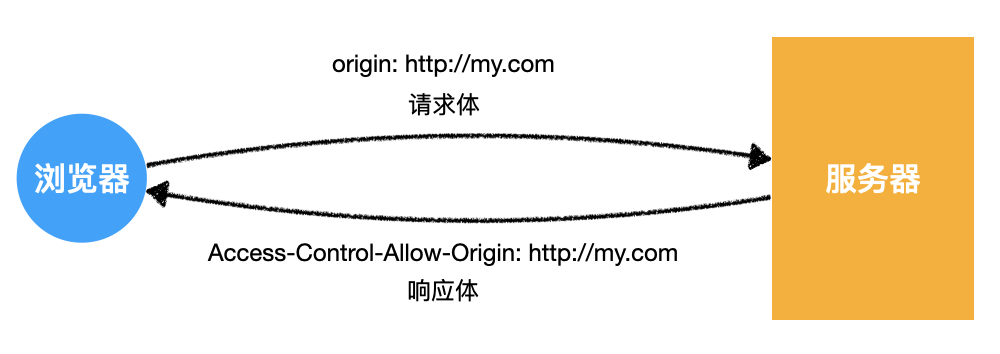

# 简单请求

## 简单请求 的判定

当请求**同时满足**以下条件时，浏览器会认为它是一个简单请求：

+ **请求方法属于下面的一种：**

  + get
  + post
  + head

+ **请求头仅包含安全的字段，常见的安全字段如下：**

  + `Accept`
  + `Accept-Language`
  + `Content-Language`
  + `Content-Type`
  + `DPR`
  + `Downlink`
  + `Save-Data`
  + `Viewport-Width`
  + `Width`

+ **请求头如果包含****，仅限下面的值之一：** ​

  + `text/plain`
  + `multipart/form-data`
  + `application/x-www-form-urlencoded`

+ 如果以上三个条件同时满足，浏览器判定为 **简单请求**

## 请求示例

+ 其他请求方式

  ```javascript
  // 简单请求
  fetch("http://crossdomain.com/api/news");

  // 请求方法不满足要求，不是简单请求
  fetch("http://crossdomain.com/api/news", {
    method:"PUT"
  })
  ```

+ 加入了额外的请求头，不是简单请求

  ```javascript
  // 加入了额外的请求头，不是简单请求
  fetch("http://crossdomain.com/api/news", {
    headers:{
      a: 1
    }
  })
  ```

+ `content-type` 不满足要求

  ```javascript
  // 简单请求
  fetch("http://crossdomain.com/api/news", {
    method: "post"
  })

  // content-type不满足要求，不是简单请求
  fetch("http://crossdomain.com/api/news", {
    method: "post",
    headers: {
      "content-type": "application/json"
    }
  })
  ```

## 交互规范

+ 当浏览器判定某个**ajax跨域请求**是**简单请求**时，会发生以下的事情

  1. **请求头中会自动添加  （源地址 协议名 + 端口号 + 主机名） 字段**

       + 比如，在页面`http://my.com/index.html`中有以下代码造成了跨域

         ```javascript
         // 简单请求
         fetch("http://crossdomain.com/api/news");
         ```

       + 请求发出后，请求头会是下面的格式：

         ```javascript
         GET /api/news/ HTTP/1.1
         Host: crossdomain.com
         Connection: keep-alive
         ...
         Referer: http://my.com/index.html
         Origin: http://my.com  // 告诉服务器，是哪个源地址在跨域请求
         ```

       + 看到最后一行没，`Origin` 字段会告诉服务器，是哪个源地址在跨域请求

  2. **服务器响应头中应包含**

       + 当服务器收到请求后，如果允许该请求跨域访问，需要在响应头中添加 `Access-Control-Allow-Origin` 字段

       + 该字段的值可以是：

          + `*`：表示我很开放，什么人我都允许访问

          + 具体的源：比如`http://my.com`，表示我就允许你访问

          > 实际上，这两个值对于客户端 `http://my.com` 而言都一样，因为客户端才不会管其他源服务器允不允许，就关心自己是否被允许
          >
          > 当然，服务器也可以维护一个可被允许的源列表，如果请求的 `Origin` 命中该列表，才响应 `*` 或具体的源
          >
          > **为了避免后续的麻烦，强烈推荐响应具体的源**

       + 假设服务器做出了以下的响应：

        ```javascript
        HTTP/1.1 200 OK
        Date: Tue, 21 Apr 2020 08:03:35 GMT
        ...
        Access-Control-Allow-Origin: http://my.com
        ...

        消息体中的数据
        ```

       + 当浏览器看到服务器允许自己访问后，高兴的像一个两百斤的孩子，于是，它就把响应顺利的交给js，以完成后续的操作

       + 下图简述了整个交互过程

    
