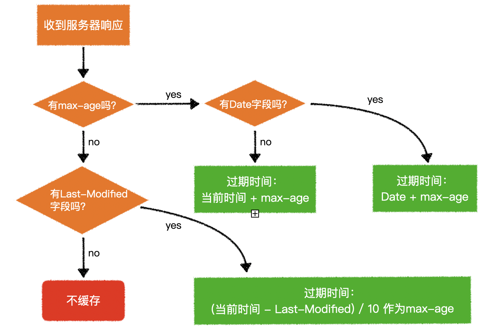
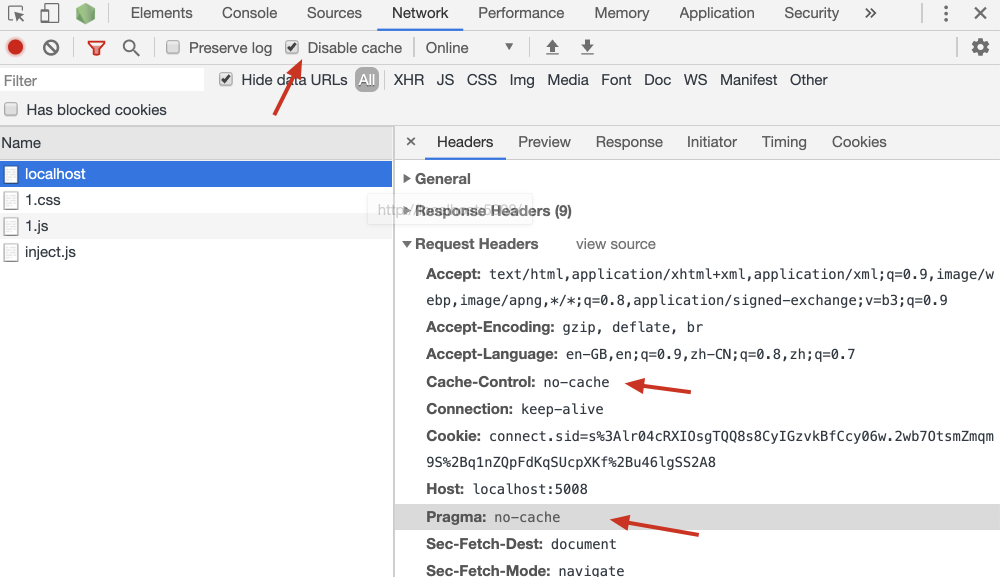
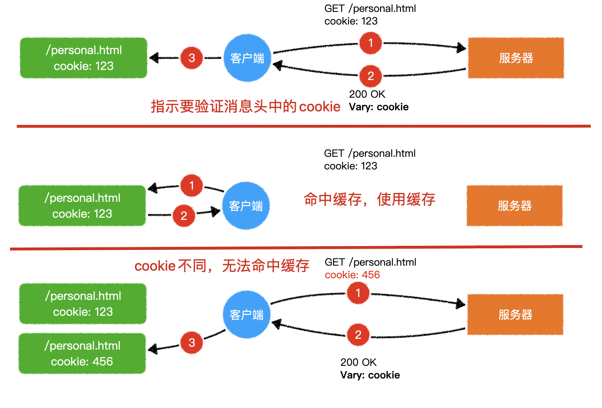

# 客户端缓存细节

## Cache-Control

  - `Cache-Control`是服务器向客户端响应的一个消息头，它提供了一个`max-age`用于指定缓存时间

  - 实际上，`Cache-Control`还可以设置下面一个或多个值

      - `public`：指示服务器资源是公开的。比如有一个页面资源，所有人看到的都是一样的。这个值对于浏览器而言没有什么意义，但可能在某些场景可能有用。本着「我告知，你随意」的原则，`http`协议中很多时候都是客户端或服务器告诉另一端详细的信息，至于另一端用不用，完全看它自己。

      - `private`：指示服务器资源是私有的。比如有一个页面资源，每个用户看到的都不一样。这个值对于浏览器而言没有什么意义，但可能在某些场景可能有用。本着「我告知，你随意」的原则，`http`协议中很多时候都是客户端或服务器告诉另一端详细的信息，至于另一端用不用，完全看它自己。

      - `no-cache`：告知客户端，你可以缓存这个资源，但是不要**直接**使用它。当你缓存之后，后续的每一次请求都需要附带缓存指令，让服务器告诉你这个资源有没有过期。见：「来自客户端的缓存指令 - 缓存无效」

      - `no-store`：告知客户端，不要对这个资源做任何的缓存，之后的每一次请求都按照正常的普通请求进行。若设置了这个值，浏览器将不会对该资源做出任何的缓存处理。

      - `max-age`：

  - 比如，`Cache-Control: public, max-age=3600`表示这是一个公开资源，请缓存1个小时

## Expire

  - 在`http1.0`版本中，是通过`Expire`响应头来指定过期时间点的，例如

    ```纯文本
    Expire: Thu, 30 Apr 2020 23:38:38 GMT
    ```

  - 到了`http1.1`版本，已更改为通过`Cache-Control`的`max-age`来记录了

## 记录缓存时的有效期

  - 浏览器会按照服务器响应头的要求，自动记录缓存到本地文件，并设置各种相关信息

  - 在这些信息中，**有效期**尤为关键，它决定了这个缓存可以使用多久

  - 浏览器会根据服务器不同的响应情况，设置不同的有效期

  - 具体的有效期设置，按照下面的流程进行

    

  - 例如，当`max-age`设置为0时，缓存立即过期

  - 虽然立即过期，但缓存仍然被记录下来，后续的请求通过缓存指令发送到服务器，来确认资源是否被更改。

  - 因此，`Cache-Control: max-age=0`类似于`Cache-Control: no-cache`

## Pragma

  - 这是`http1.0`版本的消息头

  - 当该消息头出现在请求中时，是向服务器表达：不要考虑任何缓存，给我一个正常的结果。

  - 在`http1.1`版本中，可以在**请求头**中加入`Cache-Control: no-cache`实现同样的含义

      - 是的，`Cache-Control`可以出现在请求头中

  - 在`Chrome`浏览器中调试时，如果勾选了`Disable cache`，则发送的请求中会附带该信息

    

## Vary

  - 有的时候，是否有缓存，不仅仅是判断请求方法和请求路径是否匹配，可能还要判断头部信息是否匹配。

  - 此时，就可以使用`Vary`字段来指定要区分的消息头

  - 比如，当使用`GET /personal.html`请求服务器时，请求头中`cookie`的值不一样，得到的页面也不一样

  - 如果还按照之前的做法，仅仅匹配请求方法和请求路径，如果`cookie`变动，你可能得到的仍然是之前的页面

  - 正确的做法如下

    

## 使用版本号或hash

  - 如果你是一个前端工程师，使用过`vue`或其他基于`webpack`搭建的工程

  - 你会发现打包的结果中很多文件名类似于这样

    ```纯文本
    app.68297cd8.css
    ```

  - 文件的中间部分使用了`hash`值

  - 这样做的好处是，可以让客户端大胆的、长时间的缓存该文件，减轻服务器的压力

  - 当文件改动后，它的文件`hash`值也会随之而变，比如变成了`app.446fccb8.css`

  - 这样一来，客户端要请求新的文件时，就会发现路径从`/app.68297cd8.css`变成了`app.446fccb8.css`，由于之前的缓存路径无法匹配到，因此就会发送新的请求来获取新资源了。

  - 以上是现代流行的做法。

  - 而在古老的年代，还没有构建工具出现时，人们使用的办法是在资源路径后面加入版本号来获取新版本的文件

  - 比如，页面中引入了一个css资源`app.css`，它可能的引入方式是：

    ```html
    <link href="/app.css?v=1.0.0">
    ```

  - 这样一来，缓存的路径是`/app.css?v=1.0.0`

  - 当服务器的版本发生变化时，可以给予新的版本号，让html中的路径发生变动

    ```html
    <link href="/app.css?v=1.0.1">
    ```

  - 由于新的路径无法命中缓存，于是浏览器就会发送新的普通请求来获取这个资源
