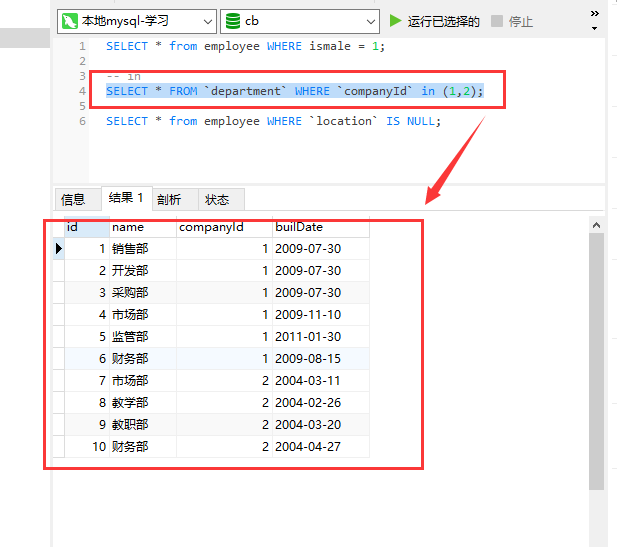

# where

## 基本语法

+ `where ...`
+ 对结果进一步筛选

  ```sql
  -- 找出在 employee 表 中 ismale = 1 的所有项
  SELECT * from employee WHERE ismale = 1;
  ```

## 条件

+ `=` `!=`

  ```sql
  -- 找出在 employee 表 中 ismale = 1 的所有项
  SELECT * from employee WHERE ismale = 1;
  ```

+ `in` 查找范围

  ```sql
  -- 查询 在 department 表中，字段 companyId 的值为 1 或 2 的 所有项
  SELECT * FROM `department` WHERE `companyId` in (1,2);
  ```

  

+ `is` 一般用于处理值为 `null`

  ```sql
  -- 查询 在 employee 表中，字段 location 的值为 null 项
  SELECT * from employee WHERE `location` IS NULL;
  ```

  

+ `is not` 一般用于处理值不为 `null`

  ```sql
  -- 查询 在 employee 表中，字段 location 的值不为 null 项
  SELECT * from employee WHERE `location` IS NOT NULL;
  ```

+ `>` 、 `<` 、 `>=` 、 `<=`

  ```sql
  SELECT * from `employee` WHERE salary >= 10000;
  ```

+ `between` 在什么之间

  ```sql
  -- 查询 在 employee 表中，字段 salary 的值在 10000 与 12000 之间的项
  SELECT * from `employee` WHERE salary BETWEEN 10000 and 12000;
  ```

+ `like` 模糊查询

  + `%`

    + `%关键字%`：查询关键字 在中间 的那一项
    + `%关键字`：查询关键字 在最后 的那一项
    + `关键字%`：查询关键字 在最开始 的那一项

    ```sql
    SELECT * from `employee` WHERE `name` LIKE '%周%';
    ```

  + `_` 匹配一个字符

    + `关键字_`
    + `关键字__`

    ```sql
    SELECT * from `employee` WHERE `name` LIKE '周__'
    ```


+ `and` 多个条件并列

  ```sql
  -- 查询 name 为 张开头，同时 ismale = 0，同时 salary 的值 >= 12000 的所有项
  SELECT * from `employee`
  WHERE `name` LIKE '张%' AND ismale = 0 AND salary >= 12000;
  ```

+ `or` 或者

  ```sql
  ```

