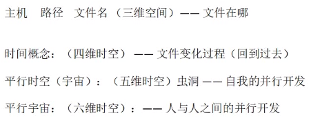
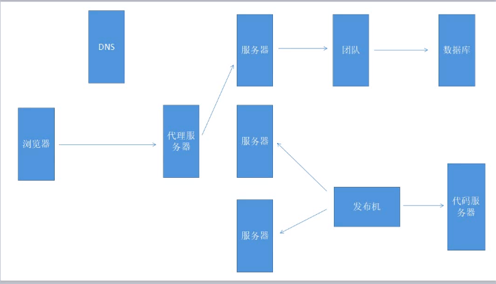

# Git

## 举例

  
  + 因此`git`更适合`自我的并行开发`（一个人同时开发多个功能）

## 服务架构

+ `浏览器`要访问页面（通过`DNS`获取IP地址）；
+ 找到`代理服务器`
  + `代理服务器`作用：分配请求到服务器
  + 分配规则：`IP哈希` 或者 `轮询`
+ 每个项目可能由多个部门合作完成
+ 代码发布过程
  1. `发布机`去`代码服务器`去拉取代码
  2. 本地打包
  3. 发布到每台服务器上
  4. 服务器重启服务
  5. 下次访问就是访问新的代码版本

  

## 怎么学好`Git`？

1. 保持好奇；
2. 学会提问；
3. 了解背景

## `Git` 工作方式

+ 代码编写
  1. 从`项目（Master）`上拉取代码到`本地仓库`，
  2. 在按功能模块分成几个子分支（例如本例中的`Branch-Login（登陆）`、`Branch-User（用户系统）`、`Branch-Search（搜索）`等等）
+ 发布代码
  1. 将`Branch-Login（登陆）`、`Branch-User（用户系统）`合并成本例的`P1`等等；
  2. 将`P1`，`M1`、`D1`合并到`master`(`代码服务器`)

  