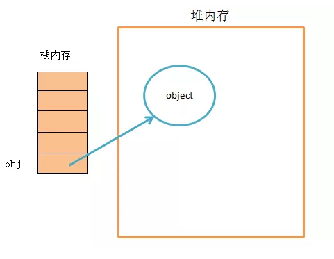

# 变量类型

## 概述

+ 类型区别

    

## 类型分类

+ 数据(基本)类型

+ 引用数据类型

## 基本类型

+ `boolean`

+ `null`

+ `undefined`

+ `number`

+ `string`

+ `Symbol` (ES6 新增，表示独一无二的值)

+ `Bigint`

## 基本类型特点

+ 特点

  + 值是不可变的

        ```js
        var name = 'java';
        name.toUpperCase(); // 输出 'JAVA'
        console.log(name); // 输出  'java'
        ```

  + 存放在栈区:原始数据类型直接存储在栈(stack)中的简单数据段，占据空间小、大小固定，属于被频繁使用数据，所以放入栈中存储

  + 值的比较

    + `==` : 只进行值的比较,会进行数据类型的转换

    + `===` : 不仅进行值得比较，还要进行数据类型的比较

## 引用数据类型

+ 类型

  + 包含普通对象-Object

  + 数组对象-Array

  + 正则对象-RegExp

  + 日期对象-Date

  + 数学函数-Math

  + 函数对象-Function

## 引用数据类型特点

+ 特点

  + 值是可变的:引用类型可以拥有属性和方法，并且是可以动态改变的

        ```js
        var a={age:20}；
        a.age=21；
        console.log(a.age)//21
        ```

  + 同时保存在栈内存和堆内存:引用数据类型存储在堆(heap)中的对象,占据空间大、大小不固定,如果存储在栈中，将会影响程序运行的性能；引用数据类型在栈中存储了指针，该指针指向堆中该实体的起始地址。当解释器寻找引用值时，会首先检索其在栈中的地址，取得地址后从堆中获得实体

        

  + 比较是引用的比较:当从一个变量向另一个变量赋引用类型的值时，同样也会将存储在变量中的对象的值复制一份放到为新变量分配的空间中

        ```js
        var a={age:20};
        var b=a;
        b.age=21;
        console.log(a.age==b.age)//true
        ```
