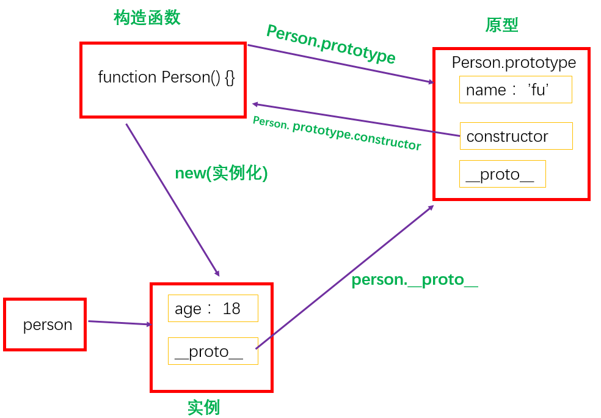
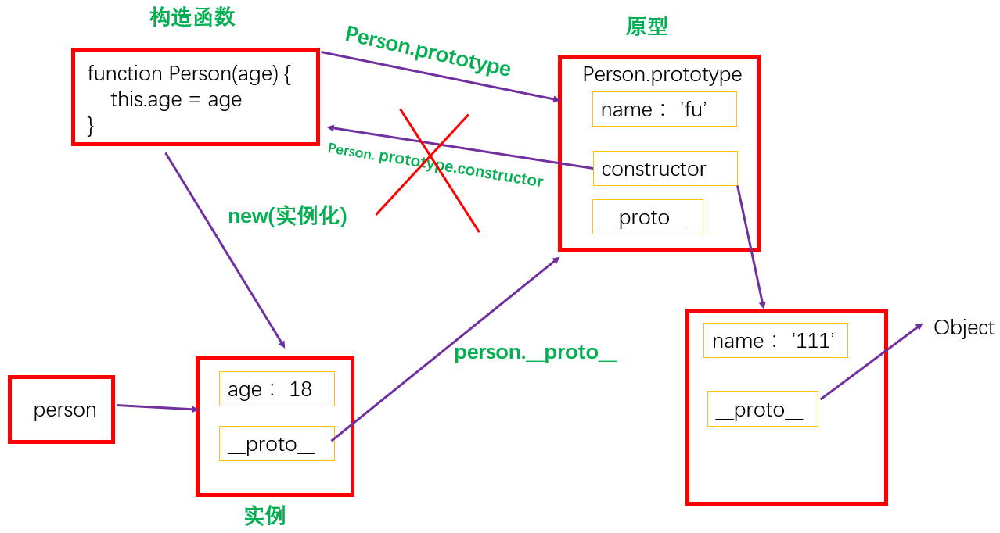
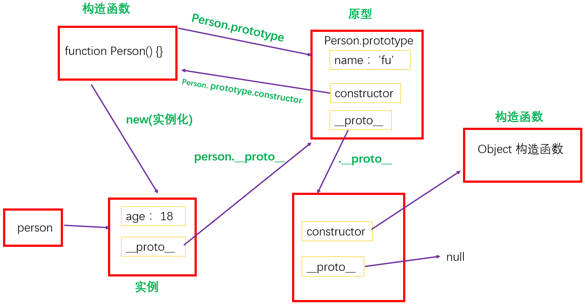

# 基础

## 构造函数定义属性和方法

  - 一般在构造器（函数体）中定义属性，在 `prototype` 属性上定义方法

  - 如此，构造器只包含属性定义，而方法则分装在不同的代码块，代码更具可读性

  - 示例

    ```js
    // 构造器及其属性定义
    function Test(a,b,c,d) {
    // 属性定义
    };

    // 定义第一个方法
    Test.prototype.x = function () { ... }

    // 定义第二个方法
    Test.prototype.y = function () { ... }

    // 等等……
    ```

## 为什么通过 new 操作符可以创建互相独立的对象呢？

  - 当我们用new操作符的时候，这个new在我们的构造函数里面隐式创建了一个this对象，并且最后返回了这个this对象，这也就是为什么我们通过new可以最后创建一个对象的原因了

    ```js
    function Person(name) {

      // new 后，隐式创建了一个this对象
      // var this = {
          //  ***
          // __proto__: person.prototype; // 当查找的属性是自身没有的属性的时候，就会先查找proto这个属性，然后这个属性指向了原型，所以就到原型上面继续查找属性了
      // }
      this.name = name;
      // 隐式 返回 this 对象
      // return this;
    }
    ```

## 构造函数与普通函数区别

1.  不需要用 `new` 关键字调用

2.  可以用 `return` 语句返回值

3.  函数内部不建议使用 `this` 关键字

4.  函数命名以驼峰方式，首字母小写

## 示例

  - 正常 `new`

    ```js
    function Person(age) {
      this.age = age;
    }
    Person.prototype.name = 'fu';
    var person = new Person(18);
    console.log(person); // Person {age: 18}

    ```

    

    

<!---->

  - 在 `new` 之后改变原型指向

    ```js
    Person.prototype.name = 'fu';
      function Person(age) {
          this.age = age;
          // var this = { __proto__: Person.prototype }
          // 只改变了 Person.prototype，并未改变 __proto__
      }
      var person = new Person(18);

      Person.prototype = {
          name: '111'
      }
      console.log(person);
      console.log(person.name); // 'fu'

    ```

    

    ```js
    // 相当于
    var obj = {name: "a"};
    var obj1 = obj;
    obj = { name: "b"}; // obj1 = {name: "a"}; obj1未改变

    // 所以
    Person.prototype = {name : 'fu'};
    __proto__: Person.prototype;
    Person.prototype = { name: '111' };
    ```

## 原型链

  - 有了原型，原型还是一个对象，那么这个名为原型的对象自然还有自己的原型，这样的原型上还有原型的结构就构成了原型链

  - 绝大部分的对象最终都会继承自Object.prototype这个对象。（我们没有规定原型的对象，它们的原型就是 `Object.prototype` ）

  - 但是并不是所有的对象都有原型

      - `var obj = Object.create(null);` // 构造出来了一个没有原型的对象

      - `undefined` `null` 也都没有原型。它们之所以能打印出来，是因为不调用任何方法的，直接打印出来

        
