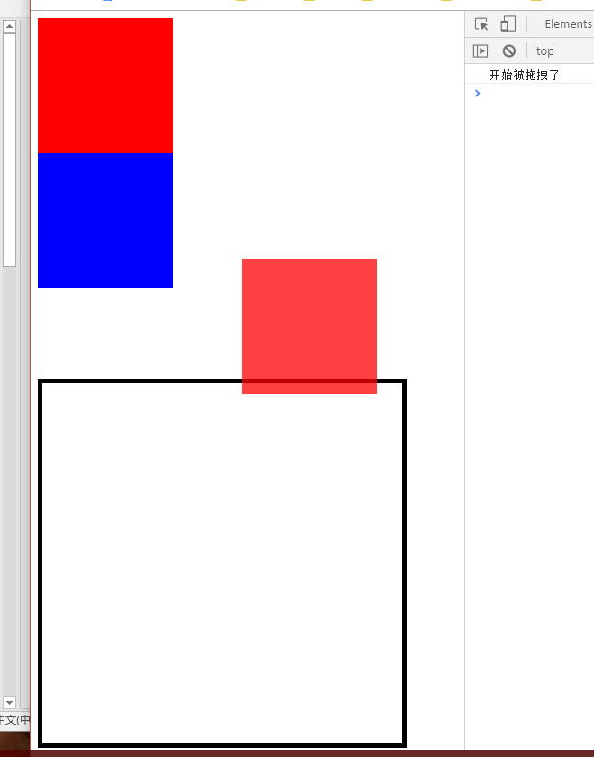
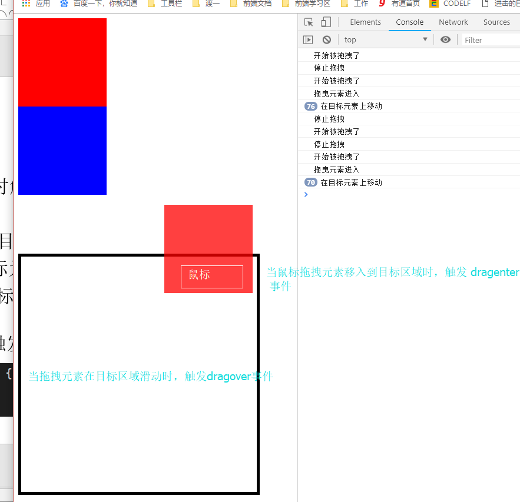

# 基础

## 创建可拖动元素

+ `<div id="div" draggable="true"></div>`

## draggable 属性

+ `auto`

+ `true`

+ `false`

## 拖动事件

+ `dragstart` 被拖拽元素 开始被拖拽时触发

+ `dragend` 被拖拽元素 拖拽完成时

+ `dragenter` 目标元素 拖曳元素进入目标元素（主要是检测鼠标是否在目标元素上）

+ `drag` :在元素被拖动时触发

## 释放区事件

+ `dragenter` 被拖动元素进入到释放区所占据得屏幕空间时触发

+ `dragover` 目标元素 拖拽元素在目标元素上移动

+ `dragleave` 当被拖动元素没有放下就离开释放区时触发

+ `drop` 目标元素 被拖拽的元素在目标元素上同时鼠标放开触发的事件

+ 需要阻止 `dragover` 的默认行为才会触发 `drop` 事件






## DragEvent 事件对象

+ `dragstart` 事件 --> `drop` 事件

+ 传值( `e.dataTransfer.setData("data",e.target.id)` )

  + 第二个参数要求是字符串，所以当想传对象时,可以使用 `JSON.stringify()` 方法进行转换

    ```js
    e.dataTransfer.setData("obj", JSON.stringify({
      id:e.target.id
    }))
    ```

+ 取值( `e.dataTransfer.getData("data")` )

  + 当传的值是对象，可以使用 `JSON.parse()`

    ```js
    JSON.parse(e.dataTransfer.getData("obj"))
    ```

## 示例 1

+ 代码

    ```css
    // css
    div{
      width: 150px;
      height: 150px;
    }
    .div1{
      background-color: red;
    }
    .div2{
      background-color: blue;
    }
    .box{
      margin-top: 100px;
      width: 400px;
      height: 400px;
      border: 5px solid #000;
    }
    ```

    ```html
    // html
    <div class="div1" draggable="true"></div>
    <div class="div2"></div>

    <div class="box"></div>
    ```

    ```js
    // js
    const div1 = document.querySelector('.div1'),
      box = document.querySelector('.box');

    div1.addEventListener('dragstart', function(e) {
      // 传值
      e.dataTransfer.setData("data",e.target.className);
      console.log('开始被拖拽了');
    }, false);

    div1.addEventListener('dragend', function() {
      console.log('停止拖拽');
    }, false);

    box.addEventListener('dragenter', function() {
      console.log('拖曳元素进入');
    }, false);

    box.addEventListener('dragover', function(e) {
      // 阻止默认事件 才会触发drop事件
      e.preventDefault();
      console.log('在目标元素上移动');
    }, false);

    box.addEventListener('drop', function(e) {
      // 取值
      const value = e.dataTransfer.getData("data");
      console.log('放开');
    }, false);
    ```
