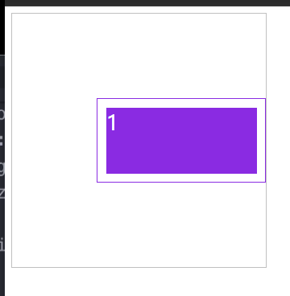

# 偏移量

## 定义

+ 使用 `span` 可以设置包含栅格的数量或包含到的区域名称

  + `grid-row-end:2` 向下包含 2 行
  + `grid-row-start:2` 向上包含 2 行
  + `grid-column-end:2` 向右包含 2 行
  + `grid-column-start:2` 向左包含 2 行

## 设置

+ 示例

  ```html
  <article>
    <div>1</div>
  </article>
  ```

  ```css
  article {
    width: 300px;
    height: 300px;
    border: 1px solid silver;
    display: grid;

    grid-template-rows: repeat(3, 1fr);
    grid-template-columns: repeat(3, 1fr);
  }
  div {
    background-color: blueviolet;
    background-clip: content-box;
    border: 1px solid blueviolet;
    padding: 10px;
    box-sizing: border-box;
    color: white;
    font-size: 25px;
  }

  div:nth-child(1) {
    grid-row-start: 2;
    grid-row-end: span 1; /* 偏移1 */
    grid-column-start: 2;
    grid-column-end: span 2; /* 偏移2 */
  }

  /* 简写 */
  div:nth-child(1) {
    grid-row: 2 / 3;
    grid-column: 2 / 4;
  }
  ```

  

## 偏移量 + 简写

+ 简写

  ```html
  <article>
    <div>1</div>
  </article>
  ```

  ```css
  article {
    width: 300px;
    height: 300px;
    border: 1px solid silver;
    display: grid;

    grid-template-rows: repeat(3, 1fr);
    grid-template-columns: repeat(3, 1fr);
  }
  div {
    background-color: blueviolet;
    background-clip: content-box;
    border: 1px solid blueviolet;
    padding: 10px;
    box-sizing: border-box;
    color: white;
    font-size: 25px;
  }

  div:nth-child(1) {
    grid-row-start: 2;
    grid-row-end: span 1; /* 偏移1 */
    grid-column-start: 2;
    grid-column-end: span 2; /* 偏移2 */
  }
  ```

## 简写

+ 可以使用 `grid-row` 设置行开始栅格线，使用 `grid-column` 设置结束栅格线。

  ```css
  /* 简写1 */
  div:nth-child(1) {
    grid-row: 2 / 3;
    grid-column: 2 / 4;
  }

  /* 简写2 推荐  */
  div:nth-child(1) {
    grid-row: 2/span 1; /* 后面的1 表示占1行 */
    grid-column: 2/span 2; /* 后面的2 表示占2列 */
  }
  ```

  
