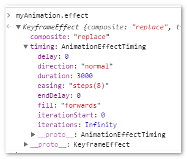
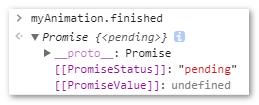

# 语法

## 参考

  - 参考文章

    <https://mp.weixin.qq.com/s?__biz=Mzg4MTYwMzY1Mw==&mid=2247496521&idx=1&sn=9bedff51351cc9fa4c541ed4ef3bbeb7&source=41#wechat_redirect>

## 语法

  - 基本语法

    ```javascript
    var myAnimation = element.animate(keyframes, options);
    ```

      - 参数1 `keyframes` : 对应CSS3中 `@keyframes` 中的声明块

      - 参数2 `options` 对应 `animation-*` 属性及属性值。也可以直接设置动画时间

      - 返回值 `myAnimation` : 为动画的 `Animation` 对象，包含多种方法

## 参数1：keyframes

  - `offset: 0.4` : 等同于CSS中40% `{ opacity: 1; }`。也就是动画进程40%位置透明度为1

    ```javascript
    element.animate([
      { opacity: 0 },
      { opacity: 1, offset: 0.4 },
      { opacity: 0 }
    ],1000);
    ```

## 参数2：options

  - `easing`: 使用 `easing` 而不是 `animation-timing-function`

  - `iterations`: 不是 `animation-iteration-count` ，而是 `iterations`。如果我们希望动画永远重复，使用 `Infinity` 而不是 `infinite`。有点混乱， `Infinity` 不带引号。`Infinity` 是一个 `JavaScript` 关键字，而其他值都是字符串

  - `duration`: 我们使用毫秒而不是秒，对于之前写过许多 JavaScript 的人来说，这应该是一样的。（你也可以在 CSS 动画中使用毫秒数，但很少有人使用。）

  - `iterationStart`:

  - `endDelay`：如果要将多个动画串在一起，但是希望在一个动画的结尾和后续动画的开始之间存在差距，这时 `endDelay` 就很有用。这是一个有用的视频

## 方法

  - `Animation.pause()` – 暂停动画

  - `Animation.play()` – 播放动画

  - `Animation.reverse()` – 动画反过来播放，直到播放到动画开始时停止。 如果动画完成或未播放，它将从头到尾播放

  - `Animation.finish()` – 动画直接结束

  - `Animation.cancel()` – 取消动画，会立即清除所有的关键帧效果

  - `Animation.updatePlaybackRate()` 在第一次同步播放位置后设置动画的速度。如果设置的值比1大，加速，如果比1小，则减速。相比直接设置playbackRate属性值，`updatePlaybackRate()` 方法不会出现动画因为速度变化突然跳一下的情况发生，因为方法内部做了优化

## 事件接口

  - `myAnimation.oncancel` 动画取消触发的回调

  - `myAnimation.onfinish` :动画结束触发的回调

## 属性

  - `myAnimation.currentTime` :动画当前时间值，单位毫秒，无论动画暂停与否又会有。如果动画缺失时间线，或者未执行，或者未激活，则返回值是 `null`

  - `myAnimation.effect` 获取或设置动画效果，通常是个关键帧效果对象。如下截图效果：

      - 如下截图效果：

  - `myAnimation.finished` : 只读。返回当前动画已完成的 `Promise`

      - 如下截图效果：

        

        

  - `myAnimation.id` : 获取或者这是动画唯一的字符标识。默认获取的值是空字符串

  - `myAnimation.pending` : 只读。动画当前是否是等待其他异步操作完成的等待状态，例如启动播放或者暂停一个正在跑的动画

  - `myAnimation.playState` : 只读。当前动画播放的状态，例如播放中的动画的返回值就是 `'running'`

  - `myAnimation.playbackRate` : 获取或设置动画播放速率。默认的线性动画的 `playbackRate` 值是1

  - `myAnimation.ready` : 只读。返回当前动画准备的Promise

  - `myAnimation.startTime` : 获取或设置动画开始播放时的预定时间

  - `myAnimation.timeline` ： 获取或设置与此动画相关联的时间线

## getAnimations

  - `getAnimations()` : 这个方法将返回所有动画对象的数组，包含使用 WAAPI 定义的动画和 CSS 转换或动画

    ```javascript
    element.getAnimations();
    ```

  - 如果你喜欢使用 CSS 来定义和使用动画，`getAnimations()` 允许 API 与 `@keyframes` 结合使用。你可以继续使用 CSS 进行大部分动画工作，然后在需要 API 时获得使用 API 的优势

  - 即使一个 DOM 元素只使用到一个动画，`getAnimations()` 也将始终返回一个数组。我们使用那个单一的动画对象来处理

    ```javascript
    var h2 = document.querySelector("h2");
    var myCSSAnimation = h2.getAnimations()[0];
    ```

  - 我们也可以在 CSS 动画中使用 `web animation API`

    ```javascript
    myCSSAnimation.playbackRate = 4;
    myCSSAnimation.reverse();
    ```

## 注意点

  - CSS 动画中使用的属性值与Web动画中使用的属性值存在一些小的差异

  - 比如,Web动画中不能使用字符串 `infinite` ，而是使用Javascript的关键字 `Infinity`

  - 以及我们用 `easing` 来代替 `timing-function`

  - 我们不必在这列出 `easing` 的值，因为不像在CSS动画里，默认的 `animation-timing-function` 是 `ease` 。页面动画API的默认 `easing` 是 `linear` 而这就是我们想要的
