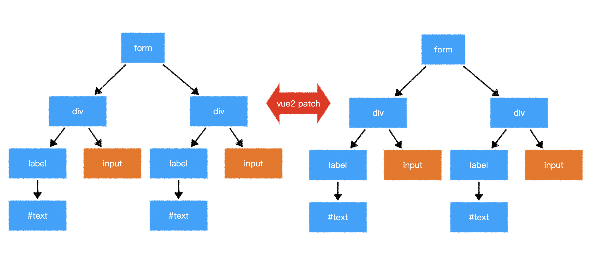

# 效率提升

## 提升点

  - 客户端渲染效率比vue2提升了1.3\~2倍

  - SSR渲染效率比vue2提升了2\~3倍

## 面试题：vue3的效率提升主要表现在哪些方面？

1.  静态提升

2.  预字符串化

3.  缓存事件处理函数

4.  Block Tree

5.  PatchFlag

## 静态提升

  - 下面的静态节点会被提升

      - 元素节点

      - 没有绑定动态内容

    ```html
    <h1>Hello World</h1>
    ```

    ```js
    // vue2 的静态节点
    render(){
      createVNode("h1", null, "Hello World")
      // ...
    }

    // vue3 的静态节点
    const hoisted = createVNode("h1", null, "Hello World")
    function render(){
      // 直接使用 hoisted 即可
    }
    ```

  - 静态属性会被提升

    ```html
    <div class="user">
      {{user.name}}
    </div>
    ```

    ```js
    const hoisted = { class: "user" }

    function render(){
      createVNode("div", hoisted, user.name)
      // ...
    }
    ```

## 预字符串化

  - 示例

    ```html
    <div class="menu-bar-container">
      <div class="logo">
        <h1>logo</h1>
      </div>
      <ul class="nav">
        <li><a href="">menu</a></li>
        <li><a href="">menu</a></li>
        <li><a href="">menu</a></li>
        <li><a href="">menu</a></li>
        <li><a href="">menu</a></li>
      </ul>
      <div class="user">
        <span>{{ user.name }}</span>
      </div>
    </div>
    ```

  - 当编译器遇到大量连续的静态内容，会直接将其编译为一个普通字符串节点

    ```js
    const _hoisted_2 = _createStaticVNode("<div class=\"logo\"><h1>logo</h1></div><ul class=\"nav\"><li><a href=\"\">menu</a></li><li><a href=\"\">menu</a></li><li><a href=\"\">menu</a></li><li><a href=\"\">menu</a></li><li><a href=\"\">menu</a></li></ul>")
    ```

    

    

## 缓存事件处理函数

  - 代码

    ```html
    <button @click="count++">plus</button>
    ```

    ```js
    // vue2
    render(ctx){
      return createVNode("button", {
        onClick: function($event){
          ctx.count++;
        }
      })
    }

    // vue3
    render(ctx, _cache){
      return createVNode("button", {
        onClick: cache[0] || (cache[0] = ($event) => (ctx.count++))
      })
    }
    ```

## Block Tree

  - vue2在对比新旧树的时候，并不知道哪些节点是静态的，哪些是动态的，因此只能一层一层比较，这就浪费了大部分时间在比对静态节点上

    ```html
    <form>
      <div>
        <label>账号：</label>
        <input v-model="user.loginId" />
      </div>
      <div>
        <label>密码：</label>
        <input v-model="user.loginPwd" />
      </div>
    </form>
    ```

    

    

## PatchFlag

  - vue2在对比每一个节点时，并不知道这个节点哪些相关信息会发生变化，因此只能将所有信息依次比对

    ```html
    <div class="user" data-id="1" title="user name">
      {{user.name}}
    </div>
    ```

    
