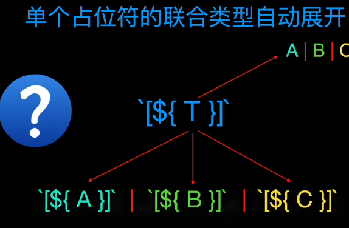

# 搭配其他类型

## 搭配type

  - 代码

    ```typescript
    type EventName<T extends string> = `${T}Change`;

    type T0 = EventName<"foo">; // "fooChange"
    ```

## 搭配联合类型

  - 当模板中的变量是一个联合类型时，每一个可能的字符串字面量都会被表示

    

    ```typescript
    type EmailLocaleIDs = "welcome_email" | "email_heading";
    type FooterLocaleIDs = "footer_title" | "footer_sendoff";

    type AllLocaleIDs = `${EmailLocaleIDs | FooterLocaleIDs}_id`;
    // type AllLocaleIDs = "welcome_email_id" | "email_heading_id" | "footer_title_id" | "footer_sendoff_id"
    ```

  - 如果模板字面量里的多个变量都是联合类型，结果会交叉相乘，比如下面的例子就有 2 \* 2 \* 3 一共 12 种结果

    

    ```typescript
    type EmailLocaleIDs = "welcome_email" | "email_heading";
    type FooterLocaleIDs = "footer_title" | "footer_sendoff";
    type AllLocaleIDs = `${EmailLocaleIDs | FooterLocaleIDs}_id`;
    type Lang = "en" | "ja" | "pt";

    type LocaleMessageIDs = `${Lang}_${AllLocaleIDs}`;
    // type LocaleMessageIDs = "en_welcome_email_id" | "en_email_heading_id" | "en_footer_title_id" | "en_footer_sendoff_id" | "ja_welcome_email_id" | "ja_email_heading_id" | "ja_footer_title_id" | "ja_footer_sendoff_id" | "pt_welcome_email_id" | "pt_email_heading_id" | "pt_footer_title_id" | "pt_footer_sendoff_id"
    ```

  - 如果真的是非常长的字符串联合类型，推荐提前生成，这种还是适用于短一些的情况

## 结合索引类型与映射类型
