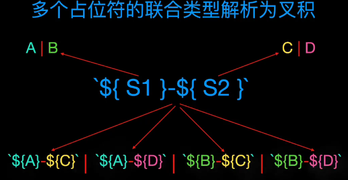

# 搭配其他类型

## 搭配type

  - 代码

    ```typescript
    type EventName<T extends string> = `${T}Change`;

    type T0 = EventName<"foo">; // "fooChange"
    ```

## 搭配联合类型

  - 当模板中的变量是一个联合类型时，每一个可能的字符串字面量都会被表示

    

    ```typescript
    type EmailLocaleIDs = "welcome_email" | "email_heading";
    type FooterLocaleIDs = "footer_title" | "footer_sendoff";

    type AllLocaleIDs = `${EmailLocaleIDs | FooterLocaleIDs}_id`;
    // type AllLocaleIDs = "welcome_email_id" | "email_heading_id" | "footer_title_id" | "footer_sendoff_id"
    ```

  - 如果模板字面量里的多个变量都是联合类型，结果会交叉相乘，比如下面的例子就有 2 \* 2 \* 3 一共 12 种结果

    

    ```typescript
    type EmailLocaleIDs = "welcome_email" | "email_heading";
    type FooterLocaleIDs = "footer_title" | "footer_sendoff";
    type AllLocaleIDs = `${EmailLocaleIDs | FooterLocaleIDs}_id`;
    type Lang = "en" | "ja" | "pt";

    type LocaleMessageIDs = `${Lang}_${AllLocaleIDs}`;
    // type LocaleMessageIDs = "en_welcome_email_id" | "en_email_heading_id" | "en_footer_title_id" | "en_footer_sendoff_id" | "ja_welcome_email_id" | "ja_email_heading_id" | "ja_footer_title_id" | "ja_footer_sendoff_id" | "pt_welcome_email_id" | "pt_email_heading_id" | "pt_footer_title_id" | "pt_footer_sendoff_id"
    ```

  - 如果真的是非常长的字符串联合类型，推荐提前生成，这种还是适用于短一些的情况

## 结合索引类型与映射类型

  - `keyof` + 模板字符串类型

    ```typescript
    interface Foo {
      name: string;
      age: number;
      job: Job;
    }

    type ChangeListener = {
      on: (change: `${keyof Foo}Changed`) => void;
    };

    declare let listener: ChangeListener;

    // 提示并约束为 "nameChanged" | "ageChanged" | "jobChanged"
    listener.on('');
    ```

## 重映射 as

  - 在映射键名时基于原键名做修改
  - 由于对象的合法键名类型包括了 `symbol` ，而模板字符串类型插槽中并不支持 `symbol` 类型。因此我们使用 `string & K` 来确保了最终交由模板插槽的值，一定会是合法的 `string` 类型

    ```typescript
    type CopyWithRename<T extends object> = {
      [K in keyof T as `modified_${string & K}`]: T[K];
    };

    interface Foo {
      name: string;
      age: number;
    }

    // {
    //   modified_name: string;
    //   modified_age: number;
    // }
    type CopiedFoo = CopyWithRename<Foo>;
    ```

    ```typescript
    // 还可以使用工具类型转换
    type CopyWithRename<T extends object> = {
      [K in keyof T as `modified${Capitalize<string & K>}`]: T[K];
    };

    // {
    //   modifiedName: string;
    //   modifiedAge: number;
    // }
    type CopiedFoo = CopyWithRename<Foo>;
    ```

## 模式匹配
