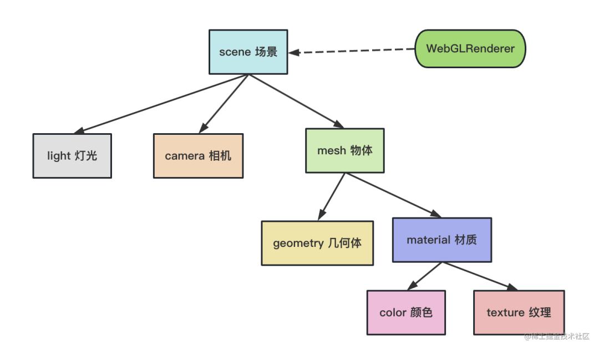
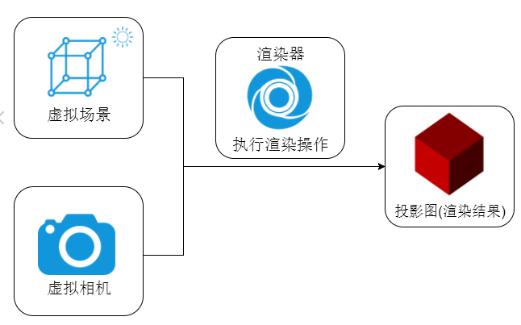

# 基础

## 概述

+ 官网 `https://github.com/mrdoob/three.js/releases`

+ three.js 是一个基于webgl的3D图像编程框架
+ three.js 以简单、直观的方式封装了3D图像编程中常用的对象

+ 所有三维场景中的东西都加到 scene 里来管理

  + 光源light：有 light 之后才能看到东西，有点光源、环境光等不同的光源
  + 相机camera：可以从不同角度去观察，改变位置就可以看到不同的风景
  + 物体mesh

    + geometry:任何一个物体都有一个形状，比如圆柱、立方体等
    + 材质 material：比如金属材质可以反光、普通材质不能

      + 材质可以指定颜色
      + 纹理 texture：指定图片作为纹理

  

## 组成部分

+ three.js 在创建一个程序的时候需要有三个对象

  1. 场景(screen) ：构建一个三维空间
  2. 相机(camera) ：选择一个观察点，并确定观察方向/角度等
  3. 渲染器(renderer)：将观察到的场景渲染到屏幕上的指定区域
  4. 对象(geometry)：所有的元素都是对象，包括几何体、模型、粒子和灯光等。这些对象可以应用不同的材质和纹理，并使用相机和光源进行渲染

  
  

## 总结

+ Three.js中的场景是一个物体的容器，开发者将需要的物体放入场景中。
+ 相机的作用就是指向场景，在场景中取一个合适的景，把它拍下来。
+ 渲染器的作用就是将相机拍摄下来的图片，放到浏览器中去显示。
+ 在定义了场景中的物体，设置好的照相机之后，渲染器就知道如何渲染出二维的结果了
+ 这时候，只需要调用渲染器的渲染函数，就能使其渲染一次了

## 下载安装与使用

+ npm

  ```shell
  npm install three
  ```

  ```shell
  pnpm add @types/three -D
  ```

+ 使用

  ```js
  // 方式 1: 导入整个 three.js核心库
  import * as THREE from 'three';
  const scene = new THREE.Scene();
  ```

  ```js
  // 方式 2: 仅导入你所需要的部分
  import { Scene } from 'three';
  const scene = new Scene();
  ```

## 版本问题

+ Three.js处于飞速发展之中，过去几年和现在Three.js基本上每个月都会发布一个新的版本，主要是增加一些新的功能，也可能废弃或更名某些API

+ 特定版本three.js文件包下载：`https://github.com/mrdoob/three.js/releases`

## threejs文件资源目录介绍

+ 下载three.js文件包解压后，你可以看到如下目录(不同版本会略有差异)。

+ 对于开发者而言，大家经常接触的是文档docs和案例examples两个文件夹，平时查看文档，可以打开文档docs里面html文件，案例examples里面提供了海量threejs功能案例

  ```text
  three.js-文件包
  └───build——three.js相关库，可以引入你的.html文件中
      │
  └───docs——Three.js API文档文件
      │───index.html——打开该文件，本地离线方式预览threejs文档
  └───examples——大量的3D案例，是你平时开发参考学习的最佳资源
      │───jsm——threejs各种功能扩展库
  └───src——Three.js引擎的源码，有兴趣可以阅读
      │
  └───editor——Three.js的可视化编辑器，可以编辑3D场景
      │───index.html——打开应用程序
  ```

## 基本示例

+ 代码

  ```js
  // 1.创建场景
  const scene = new THREE.Scene();

  // 2.创建相机
  const camera = new THREE.PerspectiveCamera(45, window.innerWidth/window.innerHeight, 0.1,1000);

  // 设置相机位置
  camera.position.set(0,0,10);
  scene.add(camera);

  // 创建一个Mesh（绿色的3D立方体），并添加到场景中
  const geometry = new THREE.BoxGeometry( 1, 1, 1 );
  const material = new THREE.MeshBasicMaterial( { color: 0x00ff00 } );
  // 更加集合体和材质创建物体
  const cube = new THREE.Mesh( geometry, material );
  // 将几何体添加到场景中
  scene.add( cube );

  // 设置照相机的位置
  camera.position.z = 5;

  // 初始化渲染器
  const renderer = new THREE.WebGLRenderer()
  // 设置渲染的尺寸大小
  renderer.setSize(window.innerWidth, window.innerHeight)
  console.log(renderer)
  // 将webgl渲染的canvas内容添加到body
  document.body.appendChild(renderer.domElement)

  // 浏览器每次渲染的时候更新立方体的旋转角度
  function animate() {
    requestAnimationFrame( animate );

    cube.rotation.x += 0.01;
    cube.rotation.y += 0.01;

    // 使用渲染器，通过相机将场景渲染进来
    renderer.render( scene, camera );
  }

  animate();
  ```
