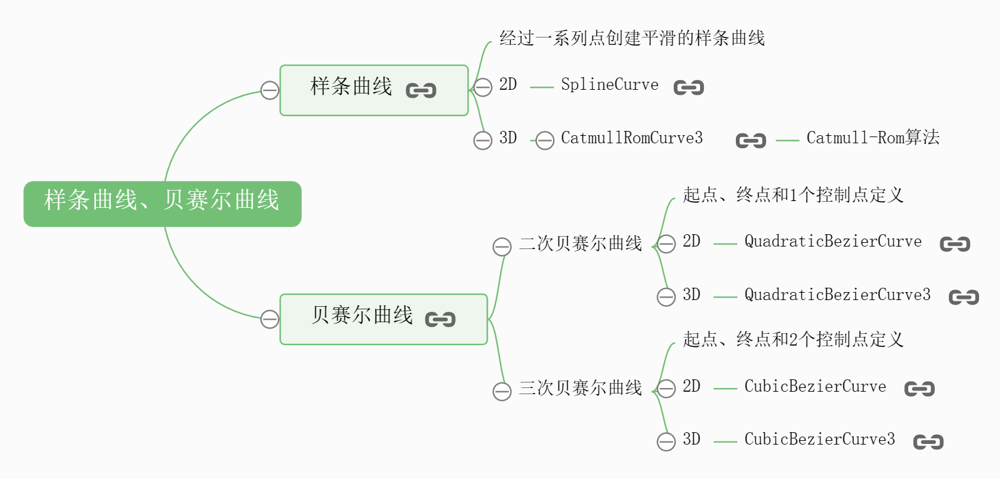

# 样条曲线

## 概述

+ 对于一些不规则的曲线，很难用一个圆、椭圆或抛物线函数去描述，这时候，可以使用threejs提供的*样条曲线*或贝*塞尔曲线*去表达

  

  + 样条曲线

    + 经过一系列点创建平滑的样条曲线
    + 2D - SplineCurve
    + 3D - CatmullRomCurve3

  + 贝塞尔曲线

    + 二次贝塞尔曲线

      + 起点、终点和1个控制点定义
      + 2D - QuadraticBezierCurve
      + 3D - QuadraticBezierCurve3

    + 三次贝塞尔曲线

      + 起点、终点和2个控制点定义
      + 2D - CubicBezierCurve
      + 3D - CubicBezierCurve3

## 三维样条曲线CatmullRomCurve3

+ 在三维空间中随意设置几个顶点坐标，然后作为三维样条曲线CatmullRomCurve3的参数，你就可以生成一条穿过这几个点的光滑曲线

+ `CatmullRomCurve3` 的参数是三维向量对象Vector3构成的数组

  ```js
  // 三维向量Vector3创建一组顶点坐标
  const arr = [
    new THREE.Vector3(-50, 20, 90),
    new THREE.Vector3(-10, 40, 40),
    new THREE.Vector3(0, 0, 0),
    new THREE.Vector3(60, -60, 0),
    new THREE.Vector3(70, 0, 80)
  ]
  // 三维样条曲线
  const curve = new THREE.CatmullRomCurve3(arr);
  ```

## 从曲线获取顶点坐标，绘制线条

+ 从曲线获取一定量顶点数据，用于绘制线模型Line，一般来说获取顶点数量越多，渲染的曲线相对越光滑

  ```js
  //曲线上获取点
  const pointsArr = curve.getPoints(100);
  const geometry = new THREE.BufferGeometry();

  //读取坐标数据赋值给几何体顶点
  geometry.setFromPoints(pointsArr);

  // 线材质
  const material = new THREE.LineBasicMaterial({
    color: 0x00fffff
  });
  // 线模型
  const line = new THREE.Line(geometry, material);
  ```

## 点模型可视化曲线经过的点

+ 点模型可视化曲线经过的点，验证样条曲线是否经过数数组arr表示的几个顶点坐标

  ```js
  // 用点模型可视化样条曲线经过的顶点位置
  const geometry2 = new THREE.BufferGeometry();
  geometry2.setFromPoints(arr);
  const material2 = new THREE.PointsMaterial({
    color: 0xff00ff,
    size: 10,
  });
  //点模型对象
  const points = new THREE.Points(geometry2, material2);
  ```

## 2D样条曲线

+ `CatmullRomCurve3` 是3D样条曲线API，曲线经过的点可以在3D空间中任何一个位置，二维样条曲线SplineCurve默认情况下就是在XOY平面生成一个平面的样条曲线

+ `SplineCurve` 的参数是二维向量对象Vector2构成的数组

  ```js
  // 二维向量Vector2创建一组顶点坐标
  const arr = [
    new THREE.Vector2(-100, 0),
    new THREE.Vector2(0, 30),
    new THREE.Vector2(100, 0),
  ];

  // 二维样条曲线
  const curve = new THREE.SplineCurve(arr);
  ```
