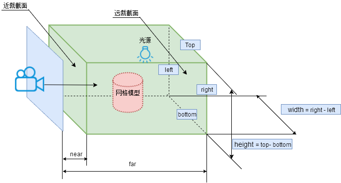

# 平行光阴影计算

## 平行光DirectionalLight阴影步骤

+ 平行光 `DirectionalLight` 阴影计算最少设置

  1. `.castShadow` 设置产生阴影的模型对象
  2. `.castShadow` 设置产生阴影的光源对象
  3. `.receiveShadow` 设置接收阴影效果的模型
  4. `.shadowMap.enabledWebGl` 渲染器允许阴影渲染
  5. `.shadow.camera` 设置光源阴影渲染范围

## 1. 模型阴影投射.castShadow

+ 模型阴影投射属性 `.castShadow` 设置产生阴影的模型对象

  ```js
  // 设置产生投影的网格模型
  mesh.castShadow = true;
  ```

## 2. 光源阴影投射属性.castShadow

+ 和产生阴影的模型一样，光源也有阴影投射属性 `.castShadow` 属性，光源默认不产生阴影，需要代码开启

  ```js
  // 平行光
  const directionalLight = new THREE.DirectionalLight(0xffffff, 1);
  // 平行光设置产生阴影的光源对象,开启光源阴影的计算功能
  directionalLight.castShadow = true;
  ```

## 3.模型阴影接收属性.receiveShadow

+ 模型阴影接收属性 `.castShadow` 设置接收阴影的模型对象

  ```js
  // 设置接收阴影的投影面
  planeMesh.receiveShadow = true;
  ```

## 4. .shadowMap.enabled允许渲染器渲染阴影

+ WebGL的渲染器的阴影贴图属性 `.shadowMap` 的属性值是一个对象，`.shadowMap` 具有 `.enabled`、 `.type` 等属性。

+ 设置 `.shadowMap.enabled=true` 允许WebGL渲染器渲染阴影

  ```js
  // 设置渲染器，允许光源阴影渲染
  renderer.shadowMap.enabled = true;
  ```

## 5. 平行光阴影相机属性.shadow.camera(阴影渲染范围)

+ 平行光 `DirectionalLight` 的 `.shadow` 属性是平行光阴影对象 `DirectionalLightShadow` ,平行光阴影对象有一个相机属性 `shadow.camera`

+ 平行光阴影相机属性 `.shadow.camera` 的属性值是一个*正投影*相机对象 `OrthographicCamera`

  ```js
  // 查看平行光阴影相机属性
  console.log('阴影相机属性',directionalLight.shadow.camera);
  ```

## CameraHelper 可视化.shadow.camera

+ `THREE.CameraHelper` 可以用来可视化正投影相机、透视投影相机对象。

  ```js
  // 可视化平行光阴影对应的正投影相机对象
  const cameraHelper = new THREE.CameraHelper(directionalLight.shadow.camera);
  scene.add(cameraHelper);
  ```

+ 平行光阴影相机的位置 `.shadow.camera.position` 默认就是平行光的位置属性 `directionalLight.position`

  ```js
  console.log('shadow.camera位置',directionalLight.shadow.camera.position);
  ```

## 5.1 .shadow.camera设置阴影渲染范围

+ `.shadow.camera` 属性值是正投影相机 `OrthographicCamera`
+ 所以 `.shadow.camera` 属性的用法可以参考前面讲解过的正投影相机 `OrthographicCamera`

  ```js
  OrthographicCamera( left, right, top, bottom, near, far )
  ```

  

+ `.shadow.camera` 作用是约束三维场景阴影计算范围，上下左右前后六个属性定义了一个长方体空间，在这个长方体空间内容的模型进行阴影计算

  ```js
  // 设置三维场景计算阴影的范围
  directionalLight.shadow.camera.left = -50;
  directionalLight.shadow.camera.right = 50;
  directionalLight.shadow.camera.top = 200;
  directionalLight.shadow.camera.bottom = -100;
  directionalLight.shadow.camera.near = 0.5;
  directionalLight.shadow.camera.far = 600;
  ```

+ 如果 `.shadow.camera` 的渲染范围设置不合理，可能会出现看不到阴影或者阴影不完整的现象
+ 比如你把代码中 `.far` 、`.right` 等相机属性设置小一些，观察阴影变化

## 示例

+ 示例

  ```js
  import * as THREE from "./three.module.min.js"
  import { OrbitControls } from 'three/addons/controls/OrbitControls.js';


  //场景
  const scene = new THREE.Scene();

  // 材质
  (() => {
    const group = new Group();

    // 平面
    const plane = (() => {
      const geometry = new PlaneGeometry( 600, 300,);
      const material = new MeshLambertMaterial( {color: 0x999999} );

      const plane = new Mesh( geometry, material );

      plane.rotation.x = -Math.PI / 2;

      // 设置接收阴影的投影面
      plane.receiveShadow = true;

      return plane
    })();

    // 立方体
    const plane1 = (() => {
      const geometry = new BoxGeometry(50,100,50);
      const material = new MeshLambertMaterial( {color: 0x00ffff} );
      const plane = new Mesh( geometry, material );
      plane.translateY(50);

      // 设置产生投影的网格模型
      plane.castShadow = true;

      return plane;
    })();

    group.add( plane,plane1);

    scene.add(group);
  })();


  //辅助观察的坐标系
  const axesHelper = new THREE.AxesHelper(100);
  scene.add(axesHelper);

  //光源设置
  (() => {
    const ambient = new THREE.AmbientLight(0xffffff, 1);
    scene.add(ambient);

    // 平行光
    const directionalLight = new THREE.DirectionalLight(0xffffff, 1);
    directionalLight.position.set(100,60,50);
    scene.add(directionalLight);

    // 平行光设置产生阴影的光源对象,开启光源阴影的计算功能
    directionalLight.castShadow = true;

    directionalLight.shadow.camera.left = -50;
    directionalLight.shadow.camera.right = 50;
    directionalLight.shadow.camera.top = 200;
    directionalLight.shadow.camera.bottom = -100;
    directionalLight.shadow.camera.near = 0.5;
    directionalLight.shadow.camera.far = 600;

    // console.log('阴影相机属性',directionalLight.shadow.camera);

    const cameraHelper = new THREE.CameraHelper(directionalLight.shadow.camera);
    scene.add(cameraHelper);

  })();

  //相机
  const width = window.innerWidth;
  const height = window.innerHeight;
  const camera = new THREE.PerspectiveCamera(30, width / height, 1, 3000);
  camera.position.set(292, 223, 185);
  camera.lookAt(0, 0, 0);

  // WebGL渲染器设置
  const renderer = (() => {
    const renderer = new THREE.WebGLRenderer({
      antialias: true, //开启优化锯齿
    });
    renderer.setPixelRatio(window.devicePixelRatio); //防止输出模糊
    renderer.setSize(width, height);
    document.body.appendChild(renderer.domElement);

    // 设置渲染器，允许光源阴影渲染
    renderer.shadowMap.enabled = true;
    return renderer;

  })();


  // 渲染循环
  function render() {
    renderer.render(scene, camera);
    requestAnimationFrame(render);
  }
  render();


  const controls = new OrbitControls(camera, renderer.domElement);

  // 画布跟随窗口变化
  window.onresize = function () {
    renderer.setSize(window.innerWidth, window.innerHeight);
    camera.aspect = window.innerWidth / window.innerHeight;
    camera.updateProjectionMatrix();
  };
  ```
