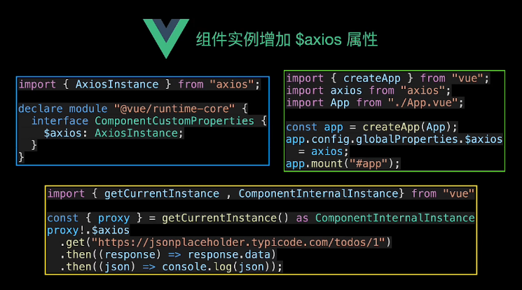
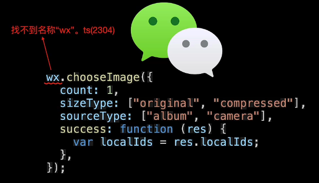
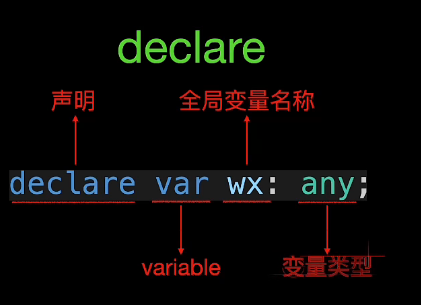

# declare编写

## 全局对象

+ 声明文件示例

    ```js
    // 例如 global.d.ts
    interface Console {
      log(mes?:any):void,
      error(mes?:any):void,
    }

    declare var console:Console

    declare function setTimeout(handler:()=> void, times:number):number
    ```

+ 使用

    ```js
    console.log(12);

    setTimeout(() => {

    }, 1000)
    ```

## 声明全局函数

+ 示例

    ```ts
    // 文件位置 typescript/lib/lib.es5.d.ts
    declare function eval(x: string): any;

    declare function parseInt(string: string, radix?: number): number;

    declare function parseFloat(string: string): number;
    ```

## 模块声明

+ 声明

    ```js
    declare module "lodash" {
      export function chunk<T>(arr:T[], len:number):T[][]
    }
    ```

+ 使用

    ```js
    import _ from "lodash",
    const newArr = _.chunk([3,4,5,6, "1"], 2);
    ```

## 扩张已有的类型

+ declare module

    

## 自定义

+ 使用 wx js-SDK

    

+ 解决方案

    

+ 更好的方案

  - 定义一个wx.d.ts 文件
