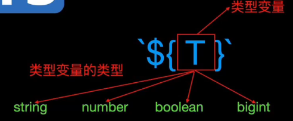

# 模板字面量

## 概述

+ 模板字面量类型以**字符串字面量类型**为基础，可以通过联合类型扩展成多个字符串

+ 当使用模板字面量类型时，它会替换模板中的变量，返回一个新的字符串字面量

 ```ts
  type World = "world";

  type Greeting = `hello ${World}`;
  // type Greeting = "hello world"
  ```

## 语法

+ `${T}`

+ T的类型 `string` `number` `boolean` `bigint` `null` `undefined`

  

+ 这些类型在最终的字符串结果中都会被转换为字符串字面量类型，即使是 `null` 与 `undefined`

 ```ts
  type Greet<T extends string | number | boolean | null | undefined | bigint> = `Hello ${T}`;

  type Greet1 = Greet<"linbudu">; // "Hello linbudu"
  type Greet2 = Greet<599>; // "Hello 599"
  type Greet3 = Greet<true>; // "Hello true"
  type Greet4 = Greet<null>; // "Hello null"
  type Greet5 = Greet<undefined>; // "Hello undefined"
  type Greet6 = Greet<0x1fffffffffffff>; // "Hello 9007199254740991"
  ```

## 直接传入类型

+ 也可以直接为插槽传入一个类型而非类型别名

  + 在这种情况下，Greeting 类型并不会变成 Hello string，而是保持原样
  + 这也意味着它并没有实际意义，此时就是一个无法改变的模板字符串类型，但所有 `Hello` 开头的字面量类型都会被视为 `Hello ${string}` 的子类型，如` Hello Linbudu` 、 `Hello TypeScript`

 ```ts
  type Greeting = `Hello ${string}`;
  ```

 ```ts
  // 声明你的版本号
  type Version = `${number}.${number}.${number}`;

  const v1: Version = '1.1.0';

  // X 类型 "1.0" 不能赋值给类型 `${number}.${number}.${number}`
  const v2: Version = '1.0';
  ```
