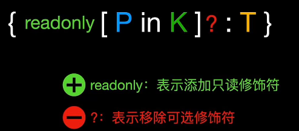

# 映射修饰符

## 概述

+ `readonly` 只读

+ `?` 可选

+ 可以通过前缀 `-` 或者 `+` 删除或者添加这些修饰符，如果没有写前缀，相当于使用了 `+` 前缀

  

  

 ```ts
  type User = {
    id: number;
    name: string;
  }
  type MyPartial<T> = {
    [P in keyof T]?: T[P];
  }

  type UserPartial = MyPartial<User>;
  // type UserPartial = {
  //   id?: number | undefined;
  //   name?: string | undefined;
  // }
  ```

 ```ts
  type LockedAccount = {
    readonly id: string;
    readonly name: string;
  };

  // 删除属性中的只读属性
  type CreateMutable<Type> = {
    -readonly [Property in keyof Type]: Type[Property];
  };

  type UnlockedAccount = CreateMutable<LockedAccount>;

  // type UnlockedAccount = {
  //    id: string;
  //    name: string;
  // }
  ```

 ```ts
  // 删除属性中的可选属性
  type Concrete<Type> = {
    [Property in keyof Type]-?: Type[Property];
  };

  type MaybeUser = {
    id: string;
    name?: string;
    age?: number;
  };

  type User = Concrete<MaybeUser>;
  // type User = {
  //    id: string;
  //    name: string;
  //    age: number;
  // }
  ```

+ 示例1

 ```ts
  type User = {
    id: number;
    name: string;
  }
  type MyPartial<T> = {
    [P in keyof T]?: T[P];
  }

  type UserPartial = MyPartial<User>;
  // type UserPartial = {
  //   id?: number | undefined;
  //   name?: string | undefined;
  // }
  ```

  
