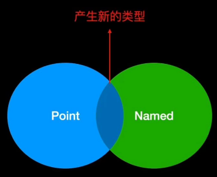
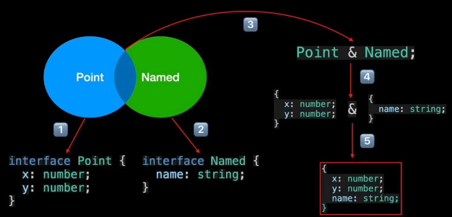
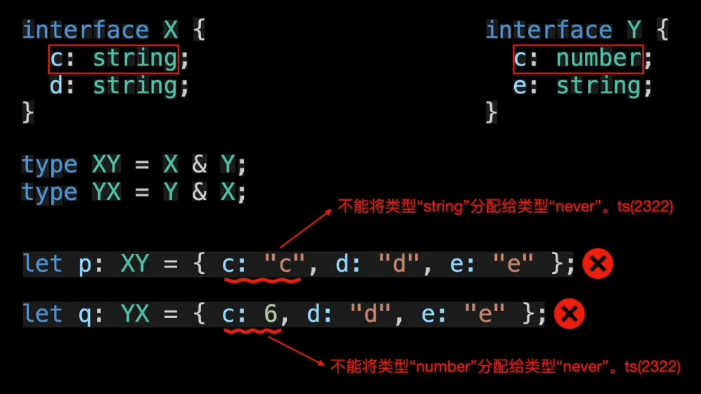

# 交叉类型&

## 数学的交集

*   可以考虑一个集合A包含一系列属于A的元素，集合B包含一系列属于B的元素。

*   所有既属于A又属于B的元素，叫做集合A和集合B的交集

    

## TS的交集

*   TypeScript 中的类型A与类型B取交集会产生新的类型，这个类型包含的对象既属于A类型又属于B类型

    

## 交叉运算符&

*   TypeScript 使用交叉运算符 & 实现多种类型的交叉运算，这时产生的类型称为交叉类型

## 交叉运算符特性

*   唯一性：A & A 等价于 A

*   交换律：A & B 等价于 B & A

*   结合律：(A & B ) & C 等价于 A & (B & C)

*   父类型收敛：如果 B 是 A 的父类型，A & B 被收敛成 A

    ```typescript
    // 1 是 number 类型的子类型
    type A = 1 & number; // type A = 1

    type A1 = "1" & string; // type A1 = "1"

    type A2 = true & boolean; // type A2 = true

    ```

## 总结

*   交叉类型会把同一类型做合并，不同类型舍弃

## 注意点

*   注意 `any` 类型和除 `never` 类型以外的任何类型交叉时都为`any`

    ```typescript
    type A3 = any & 1; // any
    type A4 = any & boolean; // any
    type A5 = any & never; // never

    type A6 = 1 & any; // any
    type A7 = boolean & any; // any
    type A8 = never & any; // never

    ```

## 对象类型交叉运算

*   对象类型交叉运算：得到的结果是包含两个对象类型属性的对象类型

*   对象类型的属性设置越多，符合该对象类型约束的对象（值）越精确。到头来要赋值时，该对象类型能表示的值的范围还是变小了

*   所以可以看到两个不同的对象类型包含不同的键，在进行交叉运算之后，会得到一个包含两者的所有键的对象类型

    ```typescript
    interface Point {
      x: number;
      y: number;
    }

    interface Named {
      name: string;
    }
    // 对象类型之间的键不一样
    type A1 = Point & Named; // {x: number;y: number;name: string;}

    const a:A1 ={
      x: 1,
      y: 2,
      name: 'name'
    }

    ```

    

*   存在一样的键：下面的示例中 c 属性的 `string` 和 `number` 类型取交叉运算，会得到 `never` 类型，因为没有一个值既是 `string` 又是 `number`

    ```typescript
    interface X {
      c: string;
      d: string;
    }

    interface Y {
      c: Number;
      e: string;
    }
    type XY = X & Y;
    const a: XY = {
      c: 'c', // 不能将类型“string”分配给类型“string & Number”。不能将类型“string”分配给类型“Number”
      d: 'd',
      e: 'e'
    }

    type YX = Y & X;
    const b: YX = {
      c: 6, // 不能将类型“number”分配给类型“Number & string”。不能将类型“number”分配给类型“string”
      d: 'd',
      e: 'e'
    }
    ```

    ```typescript
    interface X {
      c: string;
      d: string;
    }

    interface Y {
      c: Number;
      e: string;
    }
    type XY = X & Y;
    const a: XY = {
      c: 'c', // 不能将类型“string”分配给类型“string & Number”。不能将类型“string”分配给类型“Number”
      d: 'd',
      e: 'e'
    }

    type YX = Y & X;
    const b: YX = {
      c: 6, // 不能将类型“number”分配给类型“Number & string”。不能将类型“number”分配给类型“string”
      d: 'd',
      e: 'e'
    }
    ```

    
