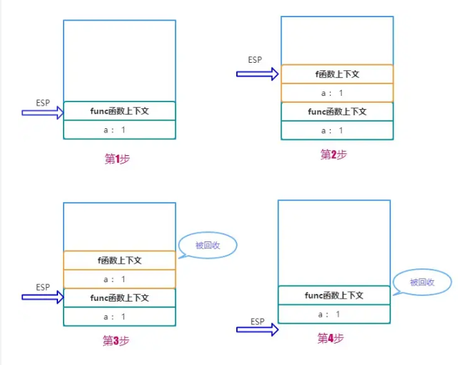

# 变量存储

## 数据是如何存储

*   基本数据类型用**栈**存储，引用数据类型用**堆**存储。

*   以下数据类型存储在栈中:

    *   boolean

    *   null

    *   undefined

    *   number

    *   string

    *   symbol

    *   bigint

*   所有的对象数据类型存放在堆中

## 赋值操作

*   原始类型的数据直接完整地赋值变量值

*   对象数据类型的数据则是复制引用地址

## 为什么不全部用栈来保存

*   对于系统栈来说，它的功能除了保存变量之外，还有创建并切换函数执行上下文的功能

    ```javascript
    function f(a) {
      console.log(a);
    }

    function func(a) {
      f(a);
    }

    func(1);
    ```

*   假设用ESP指针来保存当前的执行状态，在系统栈中会产生如下的过程：

    1.  调用func, 将 func 函数的上下文压栈，ESP指向栈顶。

    2.  执行func，又调用f函数，将 f 函数的上下文压栈，ESP 指针上移。

    3.  执行完 f 函数，将ESP 下移，f函数对应的栈顶空间被回收。

    4.  执行完 func，ESP 下移，func对应的空间被回收。

*   如果采用栈来存储相对基本类型更加复杂的对象数据，那么切换上下文的开销将变得巨大！

*   不过堆内存虽然空间大，能存放大量的数据，但与此同时垃圾内存的回收会带来更大的开销

*   示意图

    

## 垃圾回收

*   对于**栈**内存而言，当ESP指针下移，也就是上下文切换之后，栈顶的空间会自动被回收
